# 1.2 - SAS Windowing Environment 的介面

## SAS 9.4 的主要視窗概覽

SAS Windowing Environment 的介面主要如下：

<p align="center">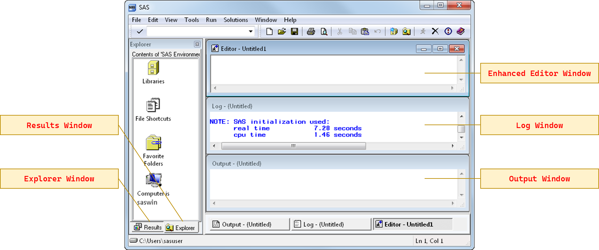<br><sup>SAS Windowing Environment 介面。<a href="https://documentation.sas.com/doc/en/pgmsascdc/9.4_3.5/lepg/n1039zk8bk9aton1fmbm7z2wji3k.htm">[原始圖源]</a></sup></p>

包含了
- **增強式編輯器 (Enhanced Editor)：** 用來輸入並提交程式碼的地方。
- **日誌 (Log)：** 檢視 SAS 回傳之訊息，包含了你輸入的 SAS statement，以及你程式執行的狀況。
- **輸出視窗 (Output)：** 傳統的結果輸出檢視器。(註：9.3 版之後有了新的檢視輸出方法)
- **結果 (Results)：** 會自動列出目前已輸出的所有結果，分別會對應到 Results Viewer 裡的不同部分。
- **檔案總管 (Explorer)** 。

下面是各視窗簡介。

---

### 檔案總管 (Explorer)

<p align="center">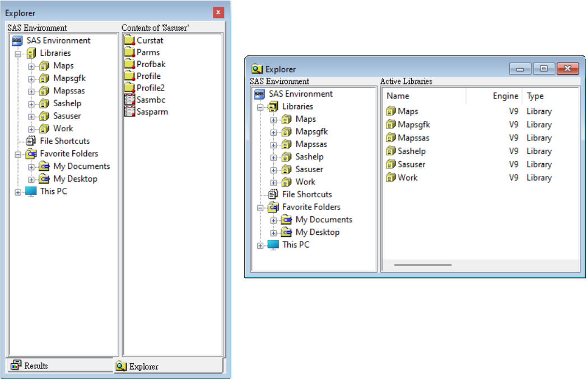<br><sup>SAS Windowing Environment 的 [檔案總管] 視窗，9.4 版中開啟時會顯示於左側畫面 (顯示如左)。<br>也可以透過選單 <b>[檢視] > [檔案總管] (View(<ins>V</ins>) > Explorer(<ins>X</ins>))</b> 的方式開始 (顯示如右)。</sup></p>

在 **\[檔案總管\]** 視窗中，您可以檢視並管理 SAS 檔，以及建立不是由 SAS 所格式化之檔案的捷徑。使用此視窗可以
- 建立新的 SAS 資料館 和 SAS 檔 
- 開啟任何 SAS 檔 
- 執行大多數的檔案管理工作，例如移動、複製和刪除檔案 
- 建立檔案捷徑。 
  
這些行為也都可以透過撰寫SAS程式碼來達成。

> [!note]
> **SAS 資料館 (SAS library)** 是一個或多個 SAS 資料檔的集合 (set)，這些檔案可由 SAS 辨識，且是被作為一個儲存單位來參考及存儲的。

您可透過工具列上的 **\[切換樹狀\]** 選項，選擇顯示包含或不含視窗內容樹狀檢視的檔案總管視窗。
<p align="center">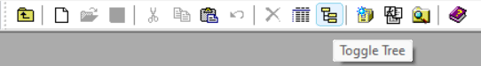<br><sup>可以點選 <b>[切換樹狀] (Toggle Tree)</b> 來選擇顯示包含或不含視窗內容樹狀內容。</sup></p>

---

### 增強式編輯器 (Enhanced Editor)

<p align="center">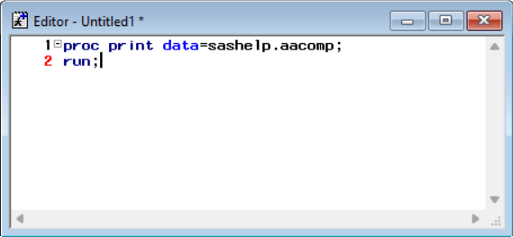<br><sup>SAS Windowing Environment 的 [增強式編輯器] 視窗。</sup></p>

SAS 9.4 的預設編輯器，有時直接被簡稱 *編輯器 (Editor)*。相較於舊版傳統的「**程式編輯器**」，它提供了更多的功能，包含：
- 可展開和可摺疊區段 
- 多層復原和取消復原
等等。


> [!note]
> 原始的編輯器 (英文版稱 *program editor*) 算是舊版 SAS 的遺物，無法依照 SAS code 內容來渲染顏色，不過更新後可以在選單中調整。但依然不支援多層的復原和取消復原，不支援個人化的顯示設定 (如字體大小等)，在編輯上也會直接覆蓋原始內容。

<p align="center">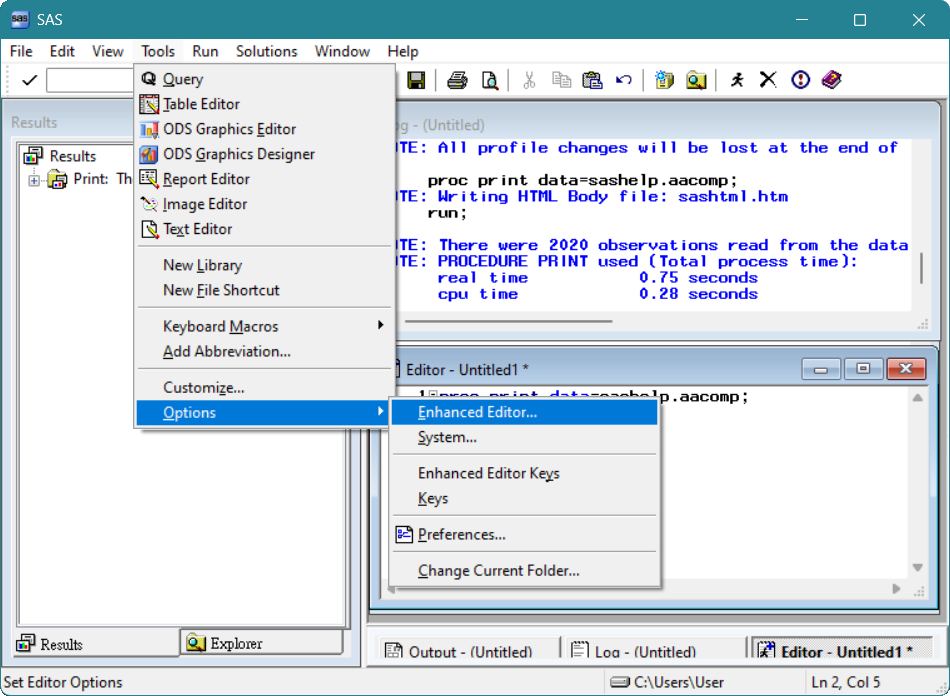 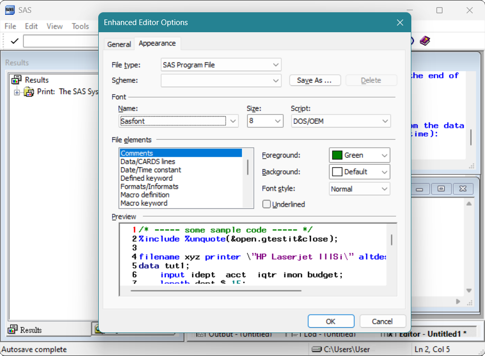<br><sup>SAS Windowing Environment 的 [增強式編輯器] 視窗。</sup></p>


---

### 日誌 (Log)

在 **\[日誌\]** 視窗中可以看到有關於 SAS session 和已提交 SAS 程式的訊息 (messages)。

> [!note]
> **SAS session (SAS 工作階段)** 是透過叫用 SAS 所建立的環境，您可在其中提供命令、提交 SAS 陳述式、接收給命令的回應、以及接收 SAS 陳述式的結果，直到您結束該環境或該環境終止為止。 

<p align="center">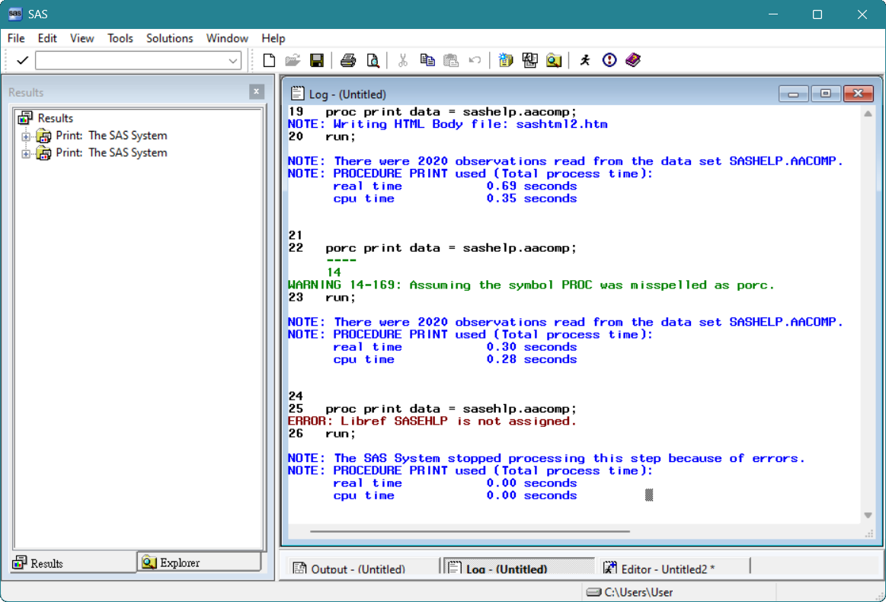<br><sup>SAS Windowing Environment 的 [日誌] 視窗。黑色部分為提交之程式碼，程式碼下方為程式執行狀況之說明。</sup></p>

> [!note] 
> **已提交 SAS 程式之訊息**，包含了你輸入的 SAS statement，以及你程式執行的狀況。程式執行狀況會以三種訊息種類來呈現：
> 
> | 訊息 (messages) | 說明 (info) |
> | --- | --- |
> | *<font color=blue>Note</font>* | 提供有關程式執行的進展 (執行進度)、特徵 (像是執行完一個 step 的觀察值數目...等) 的相關訊息。 | 
> | *<font color=green>Warning</font>* | 警告可能影響结果的潛在問題，但允許程式繼續執行 (例如部分的 misspelled error 就會自動修正，雖然跳出 warning message，卻依然正常執行)。 |
> | *<font color=red>Error</font>* | 提供導致阻止程式成功執行的問題或錯誤。 |

---

### 輸出 (Output) 與結果檢視器 (Results Viewer) 視窗
**\[輸出\]** 視窗是 SAS 9.3 之前的預設檢視輸出方法，9.3 版之後 SAS 改用 **\[結果檢視器\]** 以 HTML 方式輸出，其圖形效果更好。

> [!note]
> 9.4 版之後若想要將結果呈現在 output window 上，可以使用 `ods listing` statement。

使用 sas 軟體的範例資料集 `cars` 作為範例，我們想要在 \[輸出\] 視窗上呈現該資料的前五筆觀察值：

```sas
/* using "output window" */
ods listing;
proc print data=sashelp.cars (obs=5);
run;
ods listing close;
```

不啟用 ODS 的 LISTING 選項則會以 \[結果檢視器\] 的方式呈現。

```sas
/* using results viewer (default setting when version > 9.3) */
proc print data=sashelp.cars (obs=5);
run;
```

<p align="center">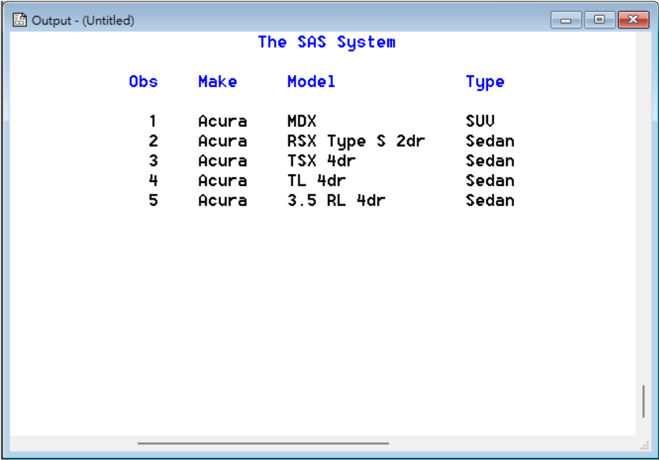 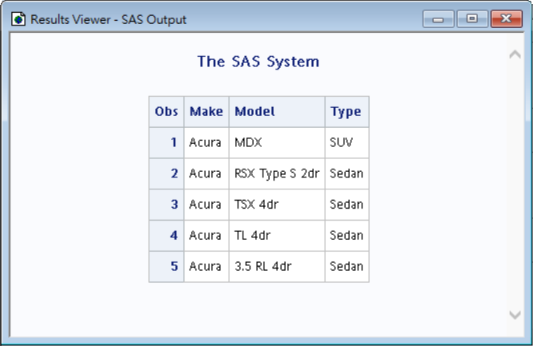<br><sup>使用 [輸出] 視窗 (左) 及 [結果檢視器] (右) 瀏覽輸出結果。[結果檢視器] 在 SAS 9.4 之後已為預設。<a></a></sup></p>

---

### 結果 (Result) 視窗

\[結果\] 視窗可讓您檢視 SAS 程式的 HTML 輸出。HTML 是預設輸出類型。當您執行 SAS 後，\[結果\] 視窗會使用樹狀結構列出各種可能可用的輸出類型。可以點選項目，以在 \[結果檢視器\] 視窗中瀏覽輸出內容。

<p align="center">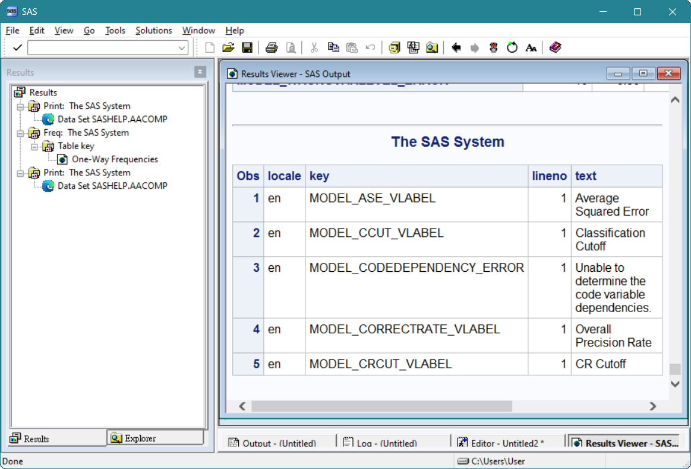<br><sup>當您提交 SAS 程式時，輸出會顯示在 [結果檢視器] (右) 中，檔案則會樹狀的列示在 [結果] 視窗 (左) 中。<a></a></sup></p>
 


<br>

## 選單及工具列

### SAS 9.4 選單 (menu)

在 SAS Windowing Environment 介面中，最上方有個選單。選單的項目會根據你當前所在的視窗 (window) 而變。

<p align="center">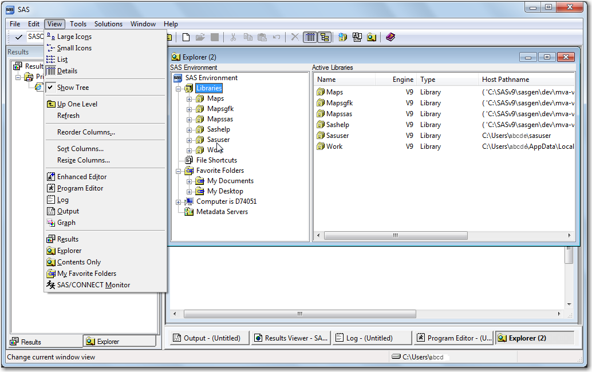 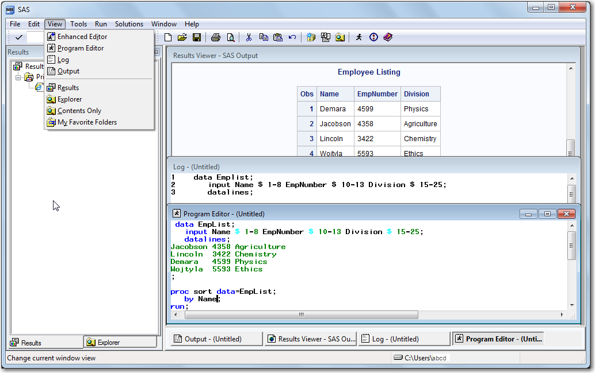<br><sup>[檔案總管] 啟用中 (左) 與 [程式編輯器] 啟用中 (右) 的 [檢視] (View) 選項。<a href="https://documentation.sas.com/doc/en/pgmsascdc/9.4_3.5/lepg/p0scdyu08q1u22n15f2tpqrqgu4v.htm">[原始圖源]</a></sup></p>


這邊記錄幾個方便的

1. 從 \[工具(<ins>T</ins>)\] > \[選項(<ins>O</ins>)\] 下面的選項可以挑整軟體介面呈現，如字體大小等。
   <p align="center">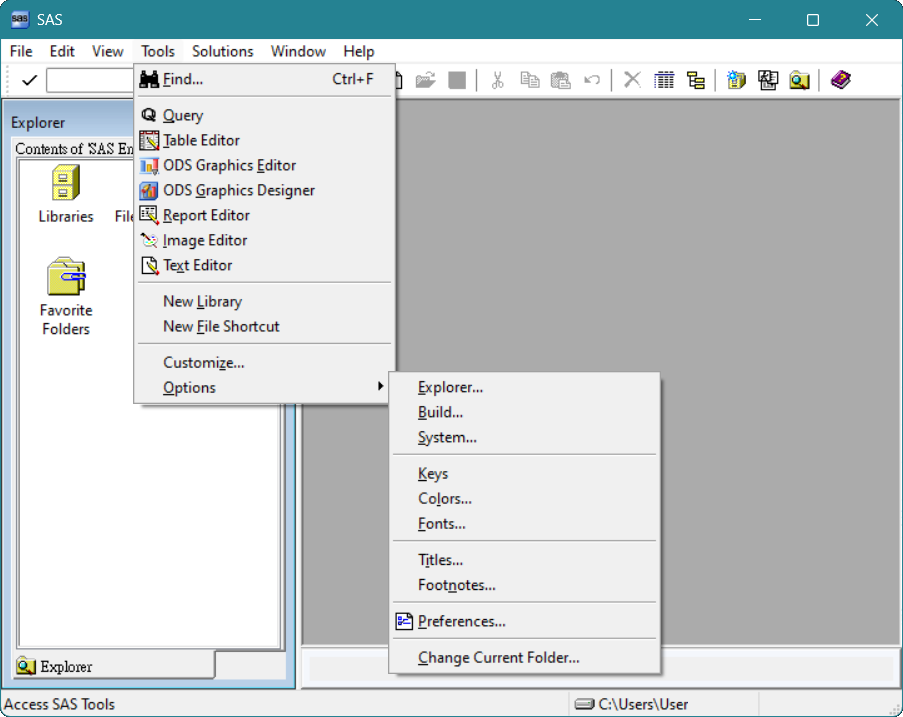<br><sup>SAS 9.4 的 [工具] (Tools) 選項。</sup></p>
2. 從 \[說明(<ins>H</ins>)\] 可以取得的不同類型的線上說明。 
    - \[使用此視窗(<ins>U</ins>)\] 是作用中視窗的工作導向說明。
    - \[SAS 說明和文件(<ins>H</ins>)\] 可讓您存取 [SAS 9 說明]，這是包含 SAS 9 之語法、範例、程序、概念和新功能的完整指南。
    - \[SAS 網站(<ins>W</ins>)\] 提供網站上資訊的連結，包括 \[技術支援\] 和 \[常見問題解答\]。
    <p align="center">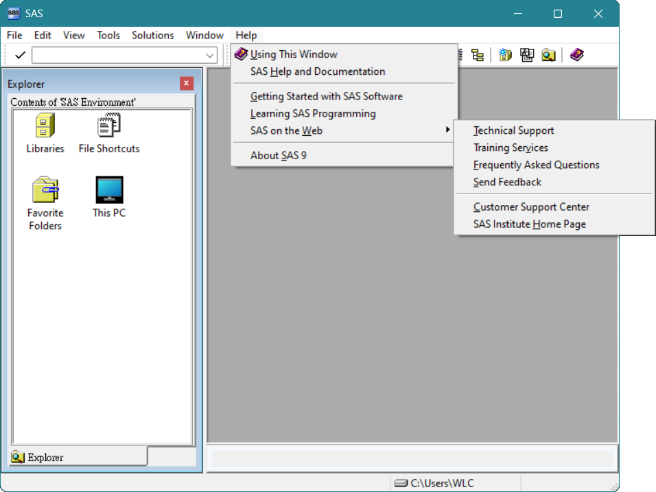<br><sup>SAS 9.4 的 [說明] (Help) 選項。</sup></p>

---

### SAS 9.4 的工具列 (toolbars)

工具列也一樣會隨著作用中的視窗而變，使用不同視窗時，工具列的內容也會變。

下圖是一個範例。

<p align="center">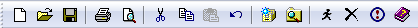<br><sup>使用 [增強式編輯器] 時的工具列。</sup></p>

其中  為**提交 (submit)** 程式。
- 無指定程式碼範圍情況下點選 ，將提交並執行當前所在檔案之所有程式碼。
- 可以框選後再點選 ，只會提交並執行指定的程式碼部分。

如果需要**中斷 (break)** 程式碼的運行，可以點選 。

<!--


在使用增強式編輯器的時候，可以透過 **Tool** > **Option** >

### SAS 的工具列 (toolbars)

<p align="center">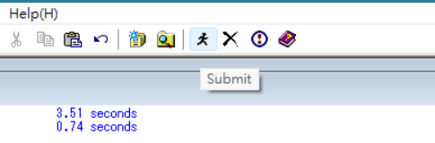<br><sup>在編輯器框選程式碼後，使用「提交」按鈕來執行程式。</sup><a></a></p>


<p align="center"><br><sup>在編輯器框選程式碼後，使用「提交」按鈕來執行程式。</sup><a></a></p>

<p align="center">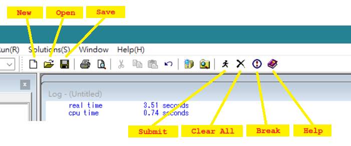<br><sup>使用增強式編輯器 (enhanced editor) 時的工具列 (toolbar)。</sup><a></a></p>

 -->
