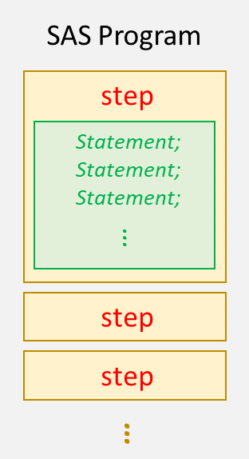

# 1.3 - 了解 SAS 程式語法

## SAS 步驟：DATA step 和 PROC step
<p align="center"><br><sup>SAS 程式由 step (步驟) 所組成。</sup></p>

SAS 程式是由一組 steps (步驟) 所組成，其中 step 又可以分成 DATA step 和 PROC step，分別會以關鍵詞 (keyword) `DATA` 或 `PROC` 開頭，以 `RUN` 做結尾：
- ***DATA* step**：
    - 用來讀取 (read)、處理 (process) 或建立 (create) 檔案。例如
        ```sas
        data mycars;                    /* 建立名為 mycars 檔案 */
            set sashelp.cars;           /* 資料讀取自 sashelp.cars */
            height_cm = height * 2.54;  /* 資料處理 */
        run;                            /* 執行 */
        ```
- ***PROC*** (Procedure) **step**：
    - 通常用來報告 (report)、管理 (manage) 或分析 (analyze) 資料。例如
        ```sas
        proc print data = mycars;       /* 對 mycars 執行 PRINT 程序 */
        run;
        ```

不過有一些程序 (procedure) 會以 `QUIT` (離開程序) 作為結尾。
```sas
proc gplot data=sales;
        plot sales * model_a;
    run;
        plot sales * model_b;
    run;
quit;
```

如果沒有以 `RUN` 或 `QUIT` 作結尾，則以下一個新的 step 的開頭為界，作為前一個 step 的結尾。
```sas
proc means data = mycars;   /* step 1 */
    var height_cm;
proc print data = mycars;   /* step 2 */
run;
```

> [!note]
> - `RUN` 與 `QUIT` 述句 (statement，或譯作*敘述句* ) 的區別在於
>      - `RUN` 述句是 **「執行前面所提交的 SAS 述句」**。
>      - 而 `QUIT` 述句 **「執行前面所提交的 SAS 述句，並結束程序 (procedure)」**。
> 
> - `QUIT` 述句用於「執行組」(***RUN-group***) 的處理，也就是一些 *可以有好幾組 `RUN` 的程序*。在這種程序當中，`RUN` 述句不會結束該程序，這使你可以在不用提交一個新的程序的情況下，繼續使用同一個程序。
>      - 舉例來說，屬於 RUN-group 的 SAS 程序有 *CATALOG* 、 *DATASETS* 和 *PLOT*。***SQL* procedure** 也是使用 `QUIT` 述句作結束。
>


## SAS 述句：global statement 和 local statement

SAS 的每一個 step 都是由述句的序列 (sequence) 組成，**所有的述句** 都會以**分號 (semicolon) `;`** 作結尾。

<p align="center"><br><sup>SAS 程式由 step (步驟) 所組成，步驟又是以 statement (述句) 組成。<br>這是 SAS 程式最基本的架構。</sup></p>

大部分的述句都會以一個關鍵詞開頭。這種類型的述句很多，除了前面提到的 `DATA`、`PROC`、`RUN` 述句以外，前面範例中出現的 `SET`、`VAR` statement 等也是。

有一種述句不會以關鍵詞開頭，就是為資料表創建一個新的欄位 (column)。
```sas
data mycars;                    
    set sashelp.cars;           
    height_cm = height * 2.54;  /* 創建新欄位 height_cm */
run;                            
```
像上面這些作用於 step 當中的述句就稱為區域述句 (local statement)，反之，作用於 step 之外且不需要 `RUN` 述句就能執行的述句，稱為全域述句 (global statement)，像是 `TITLE`、`OPTIONS`、`LIBNAME` 述句等。

<p align="center"><br><sup>SAS 程式由 step (步驟) 所組成，步驟又是以 statement (述句) 組成。<br>這是 SAS 程式最基本的架構。</sup></p>

## 其他

### 註解 (comment)
在寫程式的時候，為了事後回來方便閱讀，一般都會對一個程式區塊下註解。註解的目的只是給人閱讀，在執行程式時註解並不會被執行。

在 SAS 中，註解可以作多行註解或單行註解：
- 多行註解：使用 `/*` 和 `*/` 來框取註解內容。
- 單行註解：在述句 (句尾有 `;` ) 前面加上 `*` 即可。

例如：
```sas
/*  Contents:
    students under 13 yo */

data under13;
    set sashelp.class;
    where Age<13;
    *drop Height Weight;
run;
```

### 大小寫的區別

在大多數程式語言中，大小寫 (upper and lower cases) 是有區別的。錯誤的拼寫方式 (case) 會讓程式在編譯或執行時出現錯誤。然而在 SAS 中，**指令**與**欄位名稱**的大小寫並**不會影響程式的執行**。下面這兩個 step 對 SAS 而言是一樣的。

```sas
data under13;
    set sashelp.class;
    where Age<13;
    drop Height;
run;
```
```sas
DATA Under13;
    Set SASHELP.class;
    where age<13;
    DROP Height;
Run;
```

但是請注意，當你在指欄位的「值」(values) 的時候，大小寫就會有區別了。舉例而言，一個資料表中的 `Fruit` 欄位是 `"Apple"` 還是 `"apple"`，是截然不同的。

> [!note]
> SAS 中並不會因為大小寫差異而引發文法錯誤 (syntax errors)，常見的 SAS 文法錯誤有
> - misspelled keywords
> - unmatched quotation marks
> - missing semicolon
> - invalid options
> 
> 這些都可以在日誌中的 WARNING 或 ERROR 訊息看到。試著從日誌中的訊息了解錯誤並加以修正是重要的。