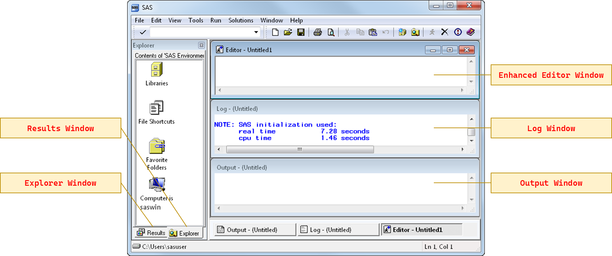
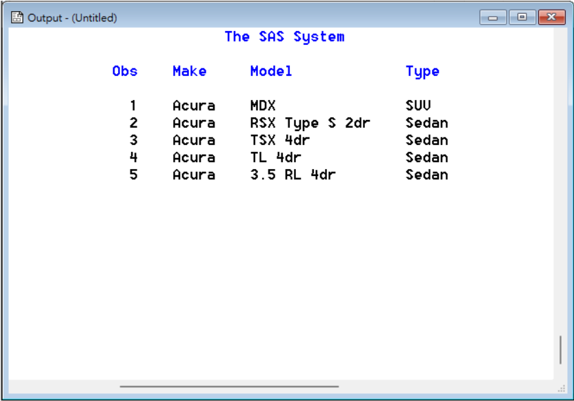
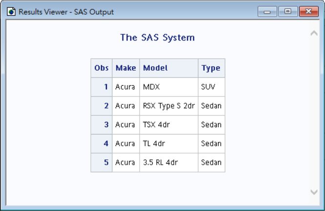
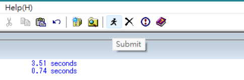

# 1.1 - SAS 程式設計工具

SAS 提供多種 programming 的介面，可以互動式的撰寫並提交程式碼。包含：

| 介面                          | 說明                                                          |
| ----------------------------- | ------------------------------------------------------------- |
| SAS Studio                    | 一個以網頁為基礎的介面，可以用於任何電腦裝置。                |
| SAS Enterprise Guide          | 一個 Windows 用戶端應用程式。可以存取本機及遠端伺服器的 SAS。 |
| **SAS Windowing environment** | SAS 的一個傳統介面。本工作坊使用此介面進行 SAS programming。  |

不論是上述哪種環境，都能夠在同一個介面中**撰寫 SAS code**、**檢視日誌 (log)** 及**輸出結果 (output)**。

> [!note]
> #### 其他程式繳交方法 (補)
> 程式其實也能透過後台的開發環境進行繳交 (submit)，像是 *batch processing*。這種模式下，日誌及結果 (result) 將會預設儲存至個別的檔案中，位置則是在 SAS 程式的所在的相同資料夾下，通常用於已經經過反覆測試、可以在無人盯守的情況下運行的例行性工作或程序。


## SAS Windowing Environment 的介面

### SAS 的主要視窗

SAS Windowing Environment 的介面主要如下：

<p align="center"></p>
<p align="center"><b>SAS Windowing Environment 介面。</b><a href="https://documentation.sas.com/doc/en/pgmsascdc/9.4_3.5/lepg/n1039zk8bk9aton1fmbm7z2wji3k.htm">[遠始圖源]</a></p>

包含了
- **增強式編輯器 (Enhanced Editor window)：** 用來輸入並提交程式碼的地方。
- **日誌 (Log window)：** 檢視 SAS 回傳之訊息，包含了你輸入的 SAS statement，以及你程式執行的狀況。
- **輸出視窗 (Output Window)：** 傳統的結果輸出檢視器。
- **結果 (Results Windows)：** 會自動列出目前已輸出的所有結果，分別會對應到 Results Viewer 裡的不同部分。
- **檔案總管 (Explorer Window)** 。

> [!note]
> #### SAS 輸出的 log
>   | message | info |
>   | --- | --- |
>   | *<font color=blue>Note</font>* | 提供有關程式執行的進展 (執行進度)、特徵 (像是執行完一個 step 的觀察值數目...等) 的相關訊息。 | 
>   | *<font color=green>Warning</font>* | 警告可能影響结果的潛在問題，但允許程式繼續執行 (例如部分的 mistyping error 就會自動修正，雖然跳出 warning message，卻依然正常執行)。 |
>   | *<font color=red>Error</font>* | 提供導致阻止程式成功執行的問題或錯誤。 |
> 
> #### Output Window 與 Results Viewer (補)
> Output window 是 SAS 9.3 之前的預設檢視輸出方法，9.3 版之後 SAS 改用結果檢視器 (results viewer) 以 HTML 方式輸出，其圖形效果更好。
> 9.4 版之後若想要將結果呈現在 output window 上，可以使用 `ods listing` statement。
> ```sas
> ods listing;
> proc print data=sashelp.cars (obs=5);
> run;
> ods listing close;
> ```
> <p align="center"></p>
> <p align="center"><sup>使用傳統 output window 瀏覽輸出。</sup><a></a></p>
> <p align="center"></p>
> <p align="center"><sup>使用 results viewer 瀏覽輸出 (SAS 9.4 之後已為預設)。</sup><a></a></p>


<p align="center"></p>
<p align="center"><sup>在編輯器框選程式碼後，使用「提交」按鈕來執行程式。</sup><a></a></p>

<p align="center"></p>
<p align="center"><sup>使用增強式編輯器 (enhanced editor) 時的工具列 (toolbar)。</sup><a></a></p>
